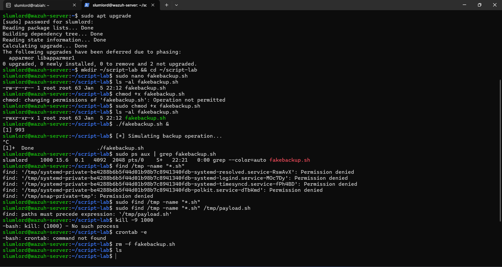

## Incident Response Basics Linux Suspicious Bash Script Execution

## 🎯 Objective:

A lab to understand the **core steps of incident response** by investigating a **suspicious bash script execution** on a Linux system. Students will learn how to detect, analyze, and respond to a basic script-based intrusion.

## 📘 **What is Incident Response?**

**Incident Response (IR)** is the process of detecting and managing a cybersecurity incident to minimize impact and restore normal operations. This lab introduces a basic Linux scenario where an attacker’s script is executed through user error or misconfiguration.

---

## 🔁 **Incident Response Process (NIST SP 800-61 Rev. 2)**

| **Phase**                         | **Description** |----------------------------------|---------------------------------------------------------------------------------|
| **1. Preparation**               | Ensure logging is enabled, tools are installed, and the system is ready.        |
| **2. Detection and Analysis**    | Identify suspicious activity using logs, running processes, and file checks.    |
| **3. Containment, Eradication, and Recovery** | Isolate the threat, remove the script, and secure the system.                    |
| **4. Post-Incident Activity**    | Document the incident and implement preventio steps.                          |

## ⚠️ Ethical Notice

This lab was conducted in a controlled environment using virtual machines owned by me. No unauthorized systems were targeted. Only perform on authorized systems you own or control.

## 🖥️ Requirements

**Systems:**  

- VirtualBox Ubuntu Server (Terminal access with sudo privileges)

**Task:**  

Monitoring system flagged a suspicious file in `/tmp`. Upon inspection, it's a bash script (`payload.sh`) that connects to an unknown IP. Tasked with investigating this incident.

### **Simulate teh attack:**

1. Create a test directory:

```bash
mkdir ~/script-lab && cd ~/script-lab
```

2. Create a Bash script:

```bash
nano fakebackup.sh
```

3. Paste the following content:

```bash
#!/bin/bash
echo "[*] Simulating backup operation..."
sleep 60
```

4. Make the script executable:

```bash
chmod +x fakebackup.sh
```

5. Simulate the Attack / Execution

Run the script in the background:

```bash
./fakebackup.sh &
```

Example output:

```bash
[*] Simulating backup operation...
```

The script now runs in the background and simulates attacker persistence.

## 🧪 Step-by-Step Investigation

### 1. Preparation

- Install curl, lsof, ps, and grep (usually pre-installed).

### 2. Detection and Analysis

- Check running processes:

```bash
ps aux | grep fakebackup.sh
```

⚠️ If only grep appears, the script has already exited. This demonstrates a common false positive during process hunting.

- Search for suspicious files:

```bash
find /tmp -name "*.sh"
```

Permission-denied messages are normal and originate from systemd private directories

### 3. Containment, Eradication, and Recovery

- Kill any related processes:

🛑 Containment, Eradication & Recovery

```bash
pkill curl
```

- Remove the malicious script:

```bash
rm -f /tmp/payload.sh
```

- Clear the crontab if persistence was found:

```bash
crontab -e
```

- Restart services if needed and log out inactive sessions.

### 4. Post-Incident Activity

- Document:
 -  What triggered the alert?
    Suspicious Bash script execution detected via process or file monitoring.
 -  What was the script doing?
    Simulated backup activity using sleep, potentially mimicking malicious persistence.
 -  Which user executed it?
    Identified via process owner and shell history.
 -  What controls could prevent this?
    Restrict script execution
    Monitor /tmp and user directories
    Enable auditd / Wazuh rules for script execution

## Conclusion

- Understanding Linux file ownership vs permissions
- Detecting background processes
- Avoiding false positives in ps | grep
- Proper containment and cleanup
- Mapping technical actions to IR frameworks

## 📸 Screenshot
