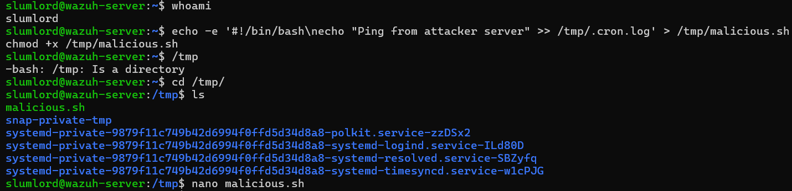
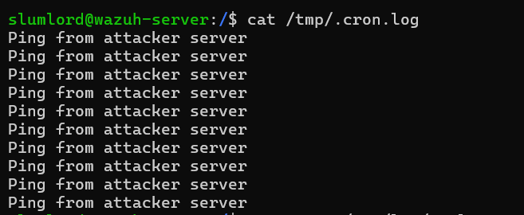
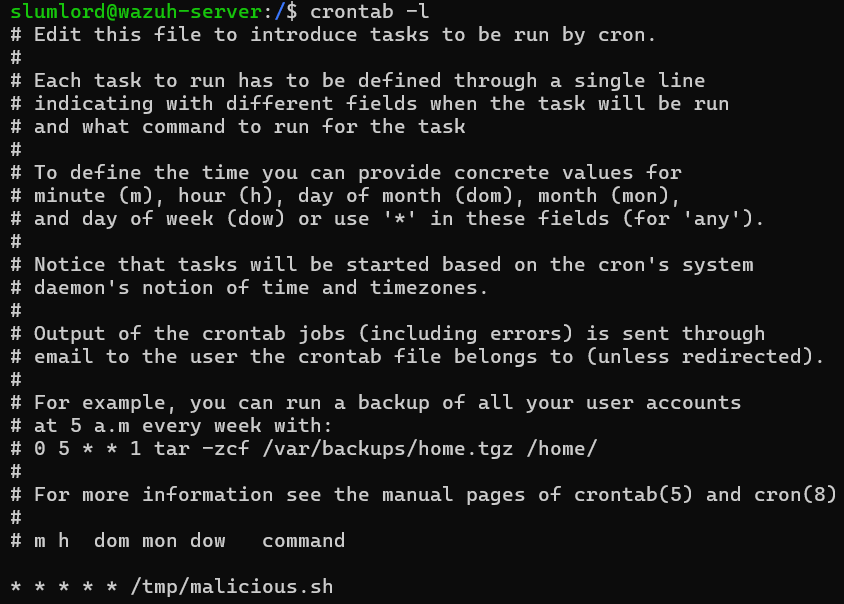
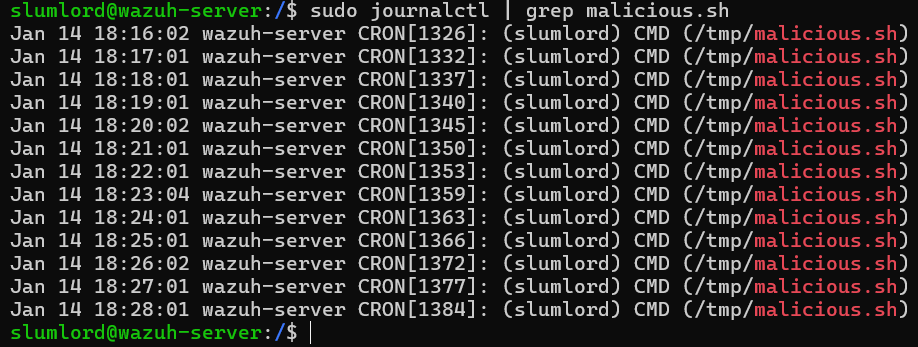

## Incident Response Detecting and Removing Malicious Cron Jobs 

## 🎯 Objective

A to investigate and respond to a malicious cron job used by an attacker to maintain persistence on a Linux system. Simulate the attack, detect the malicious scheduled task, analyze the script, and remove the threat — applying the full incident response lifecycle

## **What is a Cron Job?**

A **cron job** is a scheduled task that runs automatically at defined intervals on Unix/Linux systems. Attackers often use cron to **re-execute payloads**, reconnect to command-and-control servers, or maintain access to a compromised system.

## 🛠️Key Features:
- Run commands automatically (e.g., every minute, daily, weekly)
- Useful for backups, updates, monitoring scripts, etc.
- Works in the background via the cron service

## 🧾Format of a crontab entry:

```bash
*  *  *  *  *  command-to-run
│  │  │  │  │
│  │  │  │  └─ Day of the week (0-7, Sun = 0 or 7)
│  │  │  └──── Month (1 - 12)
│  │  └─────── Day of month (1 - 31)
│  └────────── Hour (0 - 23)
└───────────── Minute (0 - 59)
```

## **Incident Response Process (NIST SP 800-61 Rev. 2)**

The NIST Incident Response Lifecycle includes **4 main phases**:

| **Phase** | **Description** |
|----------------------------------|---------------------------------------------------------------------------------|
| **1. Preparation** | Establish policies, train team, and set up tools and logging mechanisms.       |
| **2. Detection and Analysis** | Identify potential incidents using logs, alerts, and anomaly detection systems.|
| **3. Containment, Eradication, and Recovery** | Isolate threats, remove malware/artifacts, and restore systems securely. |
| **4. Post-Incident Activity** | Conduct lessons learned, create reports, and improve incident response plans. |


## Detect and Respond: A Malicious Cron Job is Running Every Minute

## 🧰Lab Setup and Requirements

### 🖥️Machines Required:

- **VirtualBox Ubuntu Server or a Kali Linux VM**
  - Terminal with sudo access

## **Simulate the Incident:**

## **Step 1: Create a fake "malicious" script:**

1. Create a fake "malicious" script:

```bash
echo -e '#!/bin/bash\necho "Ping from attacker server" >> /tmp/.cron.log' > /tmp/malicious.sh
chmod +x /tmp/malicious.sh
```

## **Step 2: Add a cron job for the current user:**

```bash
crontab -e
```

```bash
* * * * * /tmp/malicious.sh
```

## **Step 3: Verify the cron job:**

```bash
crontab -l
```



## 🧪 Step-by-Step Investigation

### Step 1. Preparation

- Make sure cron is installed and running:

```bash
sudo apt update
sudo apt install cron -y
```

- Check if cron is available:

```bash
which crontab
```

- Expected Output:

```bash
/usr/bin/crontab
```

- Check service status:

```bash
sudo systemctl status cron
```

- Enable logging (cron logs are usually in /var/log/syslog or /var/log/cron).

### Step 2. Detection and Analysis

- Check for suspicious cron entries:

```bash
crontab -l
```

- Search cron directories for unauthorized jobs:

- Review logs to confirm execution:

```bash
cat /tmp/.cron.log
```



- Analyze the script:

```bash
cat /tmp/malicious.sh
```



- View cron activity via journalctl:

```bash
sudo journalctl -u cron
```

- What to look for:

```bash
CRON[1234]: (slumlord) CMD (/tmp/malicious.sh)
```

- Then additional filter:

```bash
sudo journalctl | grep malicious.sh
```



### Step 3. Containment, Eradication, and Recovery

- Remove the malicious cron job:

```bash
crontab -l | grep -v "malicious.sh" | crontab -
```

- Delete the script and its output:

```bash
rm -f /tmp/malicious.sh /tmp/.cron.log
```

- Restart the cron service:

```bash
sudo systemctl restart cron
```

- Confirm:

```bash
crontab -l
sudo journalctl -u cron --since "5 minutes ago"
```

### Step 4. Post-Incident Activity

- Document the following:
 - When the cron job was added
 - What the script was doing
 - Any signs of lateral movement or download activity

- Recommendations:
 - Restrict cron job access to authorized users only
 - Enable cron integrity checks
 - Set up alerts for new cron entries (using auditd or inotify)

## ✅ Conclusion
This lab demonstrated the detection and remediation of a simulated malicious cron job used for persistence on a Linux system. A benign scheduled task running every minute was identified through cron review and systemd journal analysis, confirmed via filesystem artifacts, and fully removed without disrupting services. The exercise reinforced key incident response principles—detection, containment, eradication, and documentation—aligned with the NIST SP 800-61 framework.

- Simulated attacker persistence via a user-level cron job
- Detected repeated execution using systemd journal logs
- Identified suspicious use of /tmp for payload execution
- Removed unauthorized cron entries and artifacts
- Applied structured incident response methodology without system disruption