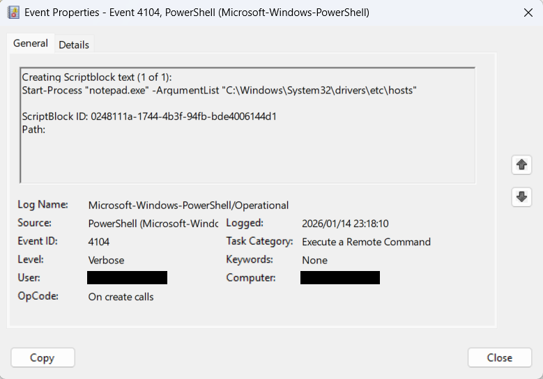
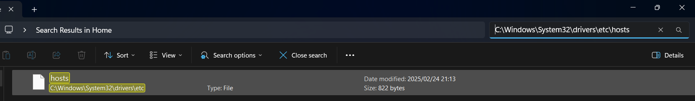

## Incident Response Detecting Suspicious PowerShell Activity

## 🎯 Objective

A lab to simulate and investigate a suspicious **PowerShell command** on a Windows system. Detecting PowerShell-based threats using built-in logs, analyze activity using Event Viewer, and perform basic incident response actions.

## 📘 **Why PowerShell Matters in Incident Response**

**PowerShell** is a powerful tool for system administration — but it’s also commonly used by attackers to download malware, move laterally, and execute hidden scripts. Proper logging and monitoring can help detect abuse.

## **Incident Response Process (NIST SP 800-61 Rev. 2)**

The NIST Incident Response Lifecycle includes **4 main phases**:

| **Phase** | **Description** |
|----------------------------------|---------------------------------------------------------------------------------|
| **1. Preparation** | Establish policies, train team, and set up tools and logging mechanisms.       |
| **2. Detection and Analysis** | Identify potential incidents using logs, alerts, and anomaly detection systems.|
| **3. Containment, Eradication, and Recovery** | Isolate threats, remove malware/artifacts, and restore systems securely. |
| **4. Post-Incident Activity** | Conduct lessons learned, create reports, and improve incident response plans. |

## Suspicious PowerShell Command Executed

## 🧰Lab Setup and Requirements

### 🖥️Machines Required:

- **Windows 10/11 or Windows Server 2019/2022**

- **Tools:**
  - **Windows Event Viewer** (pre-installed)
  - **PowerShell (Pre-installed on Windows)**
  - **Administrative Privileges** (required for enabling logs)

## **Preparation:**

Before proceeding, make sure PowerShell script block logging is enabled on your system:

1. Press `Win + R`, type `gpedit.msc`, and press Enter to open the **Group Policy Editor**.
2. Navigate to:
`Computer Configuration > Administrative Templates > Windows Components > Windows PowerShell`
3. Turn on **Module Logging**, **Script Block Logging**, and **Script Execution**.
4. Apply the settings and close the Group Policy Editor.

## **What are Windows PowerShell Logs?**
PowerShell logs contain information about PowerShell script executions, including details about the commands that were run, the processes that invoked them, and the user who executed them. These logs can be used to detect potential misuse of PowerShell, including post-exploitation techniques often used by attackers.

### **Key PowerShell Logs to Monitor:**

- **Event ID 4104**: Script block logging, capturing the PowerShell commands executed.
- **Event ID 4103**: Command invocation with parameter binding (detailed command execution).
- **Event ID 4698**: PowerShell Module Logging for the execution of specific modules.
- **Event ID 4101**: Execution of PowerShell commands through command-line arguments.

### **Step 1: Generate PowerShell Logs**

1. Open **PowerShell** as Administrator.
2. Run the following PowerShell command to generate a log entry:

```powershell
Start-Process "notepad.exe" -ArgumentList "C:\Windows\System32\drivers\etc\hosts"
```

This command
-  Starts a new process using the Start-Process cmdlet.
-  Specifies "notepad.exe" as the program to launch.
-  Passes "C:\Windows\System32\drivers\etc\hosts" as an argument to Notepad.
-  As a result, Notepad opens the hosts file directly.


### **Step 2: Visualize the events**

1. After running the command, go back to Event Viewer and navigate to:

`Applications and Services Logs → Microsoft → Windows → PowerShell → Operational`

4. Look for Event ID 4103 in the logs (this will show script block logging for the PowerShell command you executed).

5. Event details, including:
 - PowerShell command that was executed
 - User who ran the command
 - Timestamp of the execution



### **Step 3: Incident Response**

1. Check the file and it content
 - Search for it in windows file explorer



`C:\Windows\System32\drivers\etc\hosts`

2. Containment:
Isolate the system: If you suspect malicious activity, you can block network connections:

Note: Usually this is done from EDR tool.

```powershell
New-NetFirewallRule -DisplayName "Block Network Access" -Direction Outbound -Action Block -Enable
```

3. Eradication:

Restore the Hosts File: If modifications to the hosts file were made without authorization, restore it from a backup:

```powershell
Copy-Item "C:\Backup\hosts" -Destination "C:\Windows\System32\drivers\etc\hosts" -Force
```

Remove Suspicious Files: If you find any suspicious files related to the incident, you can remove them:

```powershell
Remove-Item "C:\Path\To\SuspiciousFile.exe" -Force
```

4. Recovery:
Restore from Backup (if necessary): Restore the system to a clean state from backups:

```powershell
Restore-Computer -RestorePoint 1  # Restores to the first available restore point
```

Re-enable Network Access: After securing the system, re-enable network access by disabling the firewall rule:

```bash
Set-NetFirewallRule -DisplayName "Block Network Access" -Enabled False
```

5. Reporting

- Write incident response report with timeline, command etc

## ✅ Conclusion

This lab simulated and investigated suspicious PowerShell activity using native Windows logging. The command execution was captured via PowerShell operational logs, analyzed in Event Viewer, and addressed using basic incident response actions. The exercise reinforced log-based detection and response techniques aligned with the NIST SP 800-61 framework.
