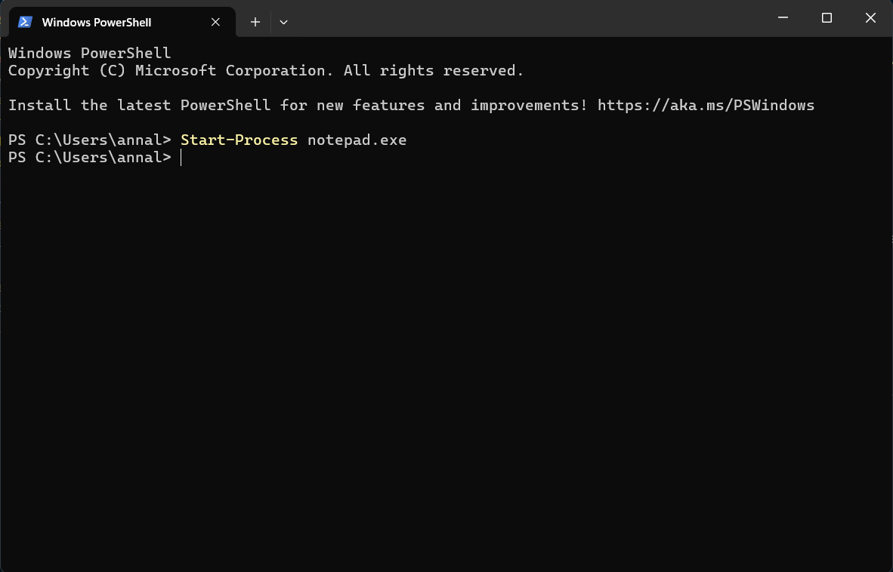
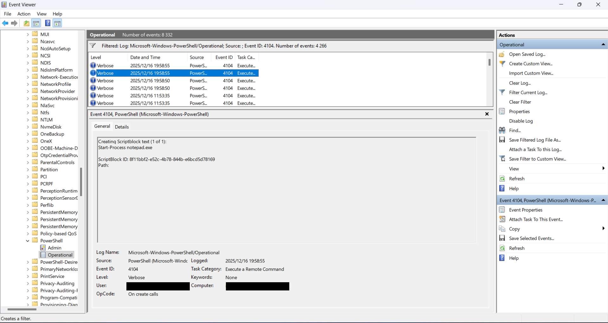
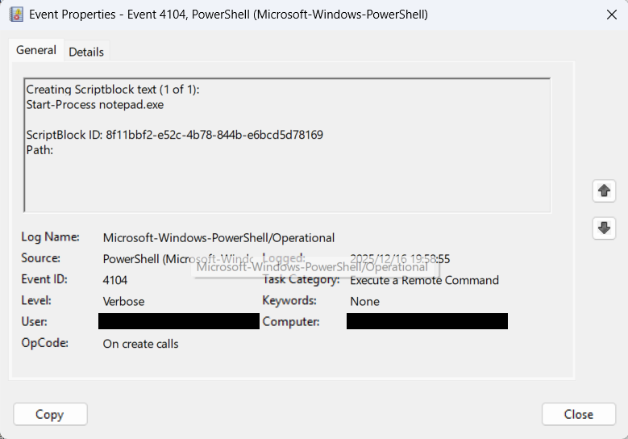

# Explore and Analyze Windows PowerShell Logs (for LOLBAS patterns)

## **What are Windows PowerShell Logs?**
PowerShell logs contain information about PowerShell script executions, including details about the commands that were run, the processes that invoked them, and the user who executed them. These logs can be used to detect potential misuse of PowerShell, including post-exploitation techniques often used by attackers.

## **What is LOLBAS?**
LOLBAS (Living Off The Land Binaries and Scripts.)

These tools are:

✅ Trusted by the OS
✅ Digitally signed by Microsoft
✅ Commonly allowed by security software

LOLBAS are legitimate programs that already exist on a system but can be used (or abused) to perform actions an attacker would normally need malware for.

🔍 Why LOLBAS Matter in Security

1. Attackers use LOLBAS to:
2. Execute commands
3. Run scripts
4. Move laterally
5. Download files
6. Execute code without writing new malware to disk

Defenders care because:

1. Antivirus may not block these tools
2. Activity blends in with normal admin behavior
3. Detection relies on logs and behavior, not signatures

🛡️ Blue Team Perspective (Important)

Using a LOLBAS binary is not malicious by itself.
It becomes suspicious when:

1. Used unexpectedly
2. Used by a non-admin user
3. Used with odd command-line arguments
4. Used to spawn unusual child processes

**My lab (PowerShell → Notepad) is a simple example.**

Example of LOLBAS Tools
These are legitimate Windows tools that attackers often abuse for stealthy malicious actions.

| 🛠️ Tool             | 📌 Path                                             | 🚩 Abuse Technique                                       |
|---------------------|-----------------------------------------------------|----------------------------------------------------------|
| **powershell.exe**  | `C:\Windows\System32\WindowsPowerShell\v1.0\powershell.exe` | Execute payloads, download malware, bypass AV |
| **certutil.exe**    | `C:\Windows\System32\certutil.exe`                  | Download files using: `certutil -urlcache -f`            |
| **mshta.exe**       | `C:\Windows\System32\mshta.exe`                     | Execute malicious HTML apps or remote scripts            |
| **regsvr32.exe**    | `C:\Windows\System32\regsvr32.exe`                  | Load and execute remote/local DLLs                       |
| **rundll32.exe**    | `C:\Windows\System32\rundll32.exe`                  | Execute DLLs or scripts to evade detection               |
| **wmic.exe**        | `C:\Windows\System32\wbem\wmic.exe`                 | Execute commands, gather system info                     |
| **bitsadmin.exe**   | `C:\Windows\System32\bitsadmin.exe`                 | Download/upload files silently                           |
| **msbuild.exe**     | `C:\Windows\Microsoft.NET\Framework\v4.0.30319\msbuild.exe` | Execute malicious C# code in project files  |
| **installutil.exe** | `C:\Windows\Microsoft.NET\Framework\v4.0.30319\installutil.exe` | Run code during .NET assembly install   |
| **schtasks.exe**    | `C:\Windows\System32\schtasks.exe`                  | Create scheduled tasks for persistence                   |

> ℹ️ For more: [lolbas-project.github.io](https://lolbas-project.github.io)

### **Key PowerShell Logs to Monitor:**
| Event ID | Meaning                   |
| -------- | ------------------------- |
| **4104** | Script Block Logging      |
| **4103** | Module Logging            |
| **400**  | PowerShell engine started |
| **403**  | PowerShell engine stopped |


## 🎯 Objective

Inroduction Windows PowerShell Logs and how it helps us understand how to analyze PowerShell-related events. Learning how to explore and analyze PowerShell logs to detect suspicious or malicious PowerShell commands that could indicate an attack or compromise.

## 🖥️ Requirements

**Systems:**  

- Windows 10/11 or Windows Server 2019/2022  

**Tools:**  

- PowerShell (pre-installed)
- Windows Event Viewer (pre-installed)
- Notepad (to create custom events, if needed)
- Administrative Privileges (to access certain security logs)

## 🔧 Step 1: Enable `gpedit.msc` (if missing)

Open Run (Win + R) and type:

gpedit.msc and click to start.

If Group Policy Editor is unavailable (Windows Home edition), PowerShell logging can alternatively be enabled via the registry. 

(For my personal lab thiese were my steps)

**gpedit cannot be found**

1. Downloaded gpedit-enabler.bat. (in this folder)
2. Place file in a folder named gpedit(or related name).
3. Right click on file adn run gpedit-enabler.bat as administrator.
4. Allow download to complete and restart computer.
5. Go to Run (Win + R) search gpedit.msc.

**Youtube Tutorial Demonstration by Tech Gene**
https://www.youtube.com/watch?v=JfJ_Mr8X2MQ

## **Step 2: Enable Windows PowerShell Logging**

Under Local Computer Policy There is Computer Configuration

Go to Adminstrative Templetes -> Windows Components -> Windows Powershell:

Click Turn on Module Logging, enable it click the button show set value to *(which is wildcard for all modules) click **OK**

Click Turn on Powershell Script Block Logging, enable it

Click Turn Script Execution, enable it set Execution Policy to **Allow all scripts**

Click Turn Powershell Transcript, enable it

Close **gpedit.msc**

## **Step 3: Simulate a LOLBAS PowerShell Command**

To simulate a LOLBAS Command that a, open PowerShell(can be normal with no special priviledges) session and run the following command:

```powershell
Start-Process notepad.exe
```



## **Step 4: Simulate a LOLBAS PowerShell Command**

Open Event Viewer to find Powershell logs(where they are stored) 

Navigate to
   `Applications and Services Logs -> Microsoft -> Windows -> then search for Powershell -> Operationals.`

Click Filter Current Log, and filter for Event ID 4104 (which logs PowerShell script execution).

Look for an entry that shows the execution of the Start-Process notepad.exe command..

Screenshots of the event details.

## 📸 Screenshots



## Conclusion:

Understanding Windows PowerShell Logs. Learning how to explore and analyze PowerShell logs to detect suspicious or malicious PowerShell commands that could indicate an attack or compromise. This lab demonstrates how PowerShell can be used as a LOLBAS to execute another Windows binary (Notepad). While benign, this behavior mirrors techniques used by attackers and highlights the importance of monitoring PowerShell activity and child process creation via Event ID 4688 and PowerShell Operational logs.

This lab demonstrates:

1. PowerShell Logs: Key to spotting malicious command usage.
2. SOC Analyst Role: Review logs to detect post-exploitation actions.
3. Threat Detection: Flags abnormal activity for faster response.

- Event ID 4104 (PowerShell Script Block Logging): A PowerShell script block logging event from the logs.