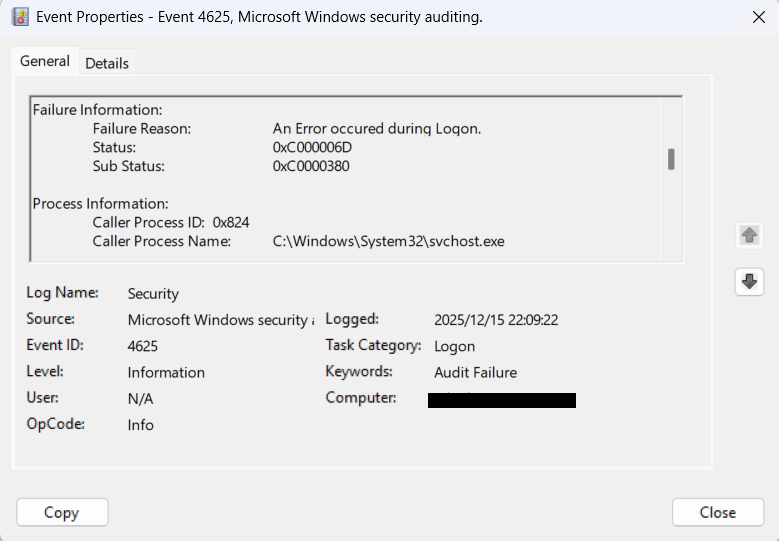
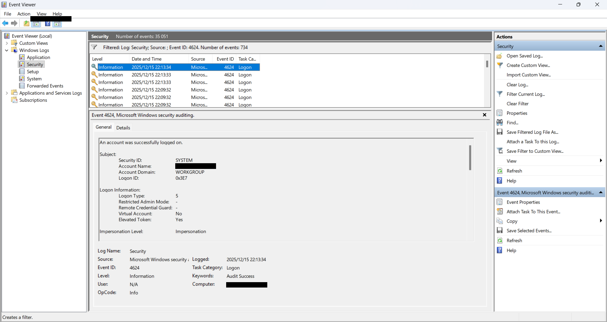
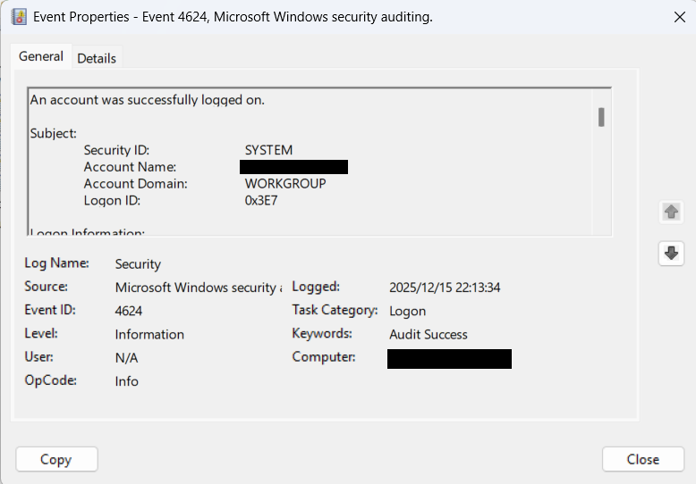

# Explore and Analyze Windows Security Logs

## 🎯 Objective

Introduction to Windows Security Logs, how to analyze logs for security-related events. Learning how to analyze various security logs such as login attempts, user account changes, and other critical system events that could indicate potential security threats.

## 🖥️ Requirements

**Systems:**  

- Windows 10/11 or Windows Server 2019/2022  

**Tools:**  

- PowerShell (pre-installed)
- Windows Event Viewer (pre-installed)
- Notepad (to create custom events, if needed)
- Administrative Privileges (to access certain security logs)

## 🔧 **Step 1: Enable Audit Logon (in Local Security Policy)**

Win + R → secpol.msc

Navigate to
   `Security Settings -> Advanced Audit Policy Configuration -> System Audit Policies - Local Group Object -> then click on Logon`

To enable audit events generated by user account logon attempts click the: 

Configure audit the following events:

- Failure
- Success

Audit Logon

**This is the Explain Section** 

This policy setting allows Windows to record events generated by user account logon attempts on the system.
For interactive logons, the event is recorded on the computer where the user logs on.
For network logons (e.g., accessing a shared folder), the event is recorded on the system hosting the resource.

The following activities are logged:

Successful logon attempts
Failed logon attempts
Logon attempts using explicit credentials (e.g., RUNAS, scheduled tasks)
Logon attempts blocked due to filtered or restricted security identifiers (SIDs)

Event volume:

Low on client machines
Medium on servers or domain controllers

Default settings:

Client editions: Success
Server editions: Success and Failure

**Close Local Security Policy after applying the changes.**

## 🔧 **Step 2: Simulate the failed Logon attempt**

1. Win + L to lock the workstation **Lock Screen**
2. Enter the incorrect Password 2-3 times
3. Enter the correct Password

## 🔧 **Step 3: View Log in Event Viewer**

Win + X → Event Veiwer

Navigate to
   `Event Veiwer(Local) -> Windows Logs -> Security`

- Event ID 4624 (Successful Login): A successful login event from the Security logs.

- Event ID 4625 (Failed Login): A failed login attempt event from the Security logs.

Filter Current Log

## 📸 Screenshots

- Event ID 4625

- Event ID 4624

## 🧠 Analysis

By reviewing Event IDs 4624 and 4625, analysts can:

Identify repeated authentication failures
Detect potential brute‑force attempts
Correlate failed logons followed by successful access
Validate whether activity is user error or suspicious behavior
These events are foundational indicators used in SOC monitoring and SIEM detection rules.

## Conclusion:

Windows Security Logs play a critical role in detecting suspicious behavior such as unauthorized login attempts, credential misuse, and potential privilege escalation.

This lab demonstrates:

1. How Windows Security Logs are used to identify malicious or abnormal authentication activity
2. How SOC analysts regularly review authentication events to detect and respond to threats
3. How monitoring failed logons, successful logons, and account‑related activity supports real‑time security incident detection
4. How log analysis is a foundational skill is essential for SOC and Blue Team roles.