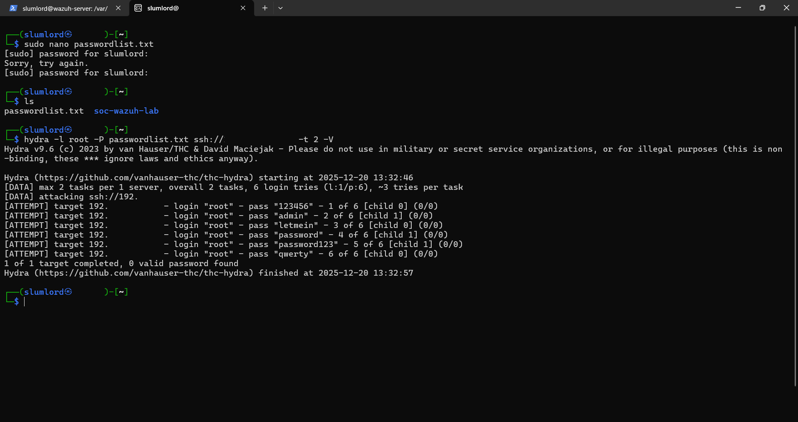
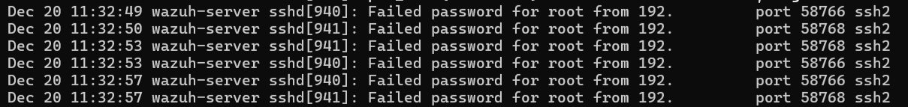

# Log Analysis Linux Brute Force Attack Log

## 🎯 Objective

Simulating an SSH brute force attack against a Linux server and demonstrating how such attacks can be detected through authentication logs by identify multiple failed login attempts and analyze patterns to uncover brute force activity.

## 🖥️ Requirements

**Systems:**  

- Attacker Machine: Kali Linux (or any Linux with hydra)
- Target Machine: Ubuntu Linux Server 

**Tools:**  

- hydra (on attacker machine)
- openssh-server (on target machine)
- rsyslog (default logging service)

**Log Sources:**

- systemd journal (journalctl) – Ubuntu Server (modern default)
- /var/log/auth.log – Traditional Ubuntu/Debian (if rsyslog enabled)
- /var/log/secure – CentOS/RHEL


## 📘 Preparation


Linux systems log every authentication event, including successful and failed SSH login attempts. Brute force attacks can be identified by analyzing patterns such as:

- Rapid failed logins from a single IP
- Attempts with multiple usernames
- Login successes after a string of failures

## 🧠 What is an SSH Brute Force Attack?

A brute force attack attempts to guess a user’s SSH password by trying many combinations quickly using automated tools like Hydra.

## Why It’s Dangerous

- Successful brute force = full shell access
- Attackers can pivot, install malware, or exfiltrate data
- It often goes unnoticed without proper log monitoring

## 🛡️ Attack Patterns Detectable via Auth Logs

- Multiple failed password attempts from one IP
- Repeated login attempts to root/admin accounts
- Success after multiple failures (brute force success)
- Logins from unknown or foreign IPs

## What is Hydra?

Hydra is a fast, open-source password-cracking tool used for brute force attacks on logins.
It supports 50+ protocols like SSH, FTP, HTTP, SMB, and more.
Common use: penetration testing and checking for weak passwords in network services.

## ⚠️ Ethical Notice

This lab was conducted in a controlled environment using virtual machines owned by me. No unauthorized systems were targeted. Only perform on authorized systems you own or control.

Syntax: 

```bash
hydra -L users.txt -P passlist.txt <protocol>://<target_ip>
```

- Use -l/-p for single username/password or -L/-P for files.
- Add -vV for verbose output and -t 4 to set number of threads.

## **Step 1: Attack Simulation – Brute Force SSH using Hydra** 

Check if ssh is is up on victem machine:

```bash
sudo systemctl status ssh
```

On the Attacker Machine (Kali machine in my case) run to simulate brute force attack:

- I created small password list txt file (passwordlist.txt) and used it safely simulate a brute force attack.

```bash
hydra -l root -P passwordlist.txt ssh://TARGET-IP -t 2 -V
```

This command will attempt multiple password guesses for user root on the SSH port.


## **Step 2: Detection and Analysis – Analyze Auth Logs**

Repeated failed login attempts from the same source IP within a short timeframe indicate automated brute force activity.

Check for failed login attempts:

```bash
sudo journalctl -u ssh | grep "Failed password"
```

Count failed attempts per IP:

```bash
sudo journalctl -u ssh | grep "Failed password" | awk '{print $(NF-3)}' | sort | uniq -c
```

Watch live log activity:

```bash
sudo journalctl -u ssh -f
```

## 📸 Screenshots



## Conclusion

- Linux authentication logs are critical for detecting brute force attacks
- Multiple failures from a single IP is a strong signal of attack
- Modern Ubuntu systems use systemd journal instead of traditional auth.log files
- Brute force attacks can be mitigated using tools such as fail2ban, firewalls, and SIEM solutions like Wazuh


