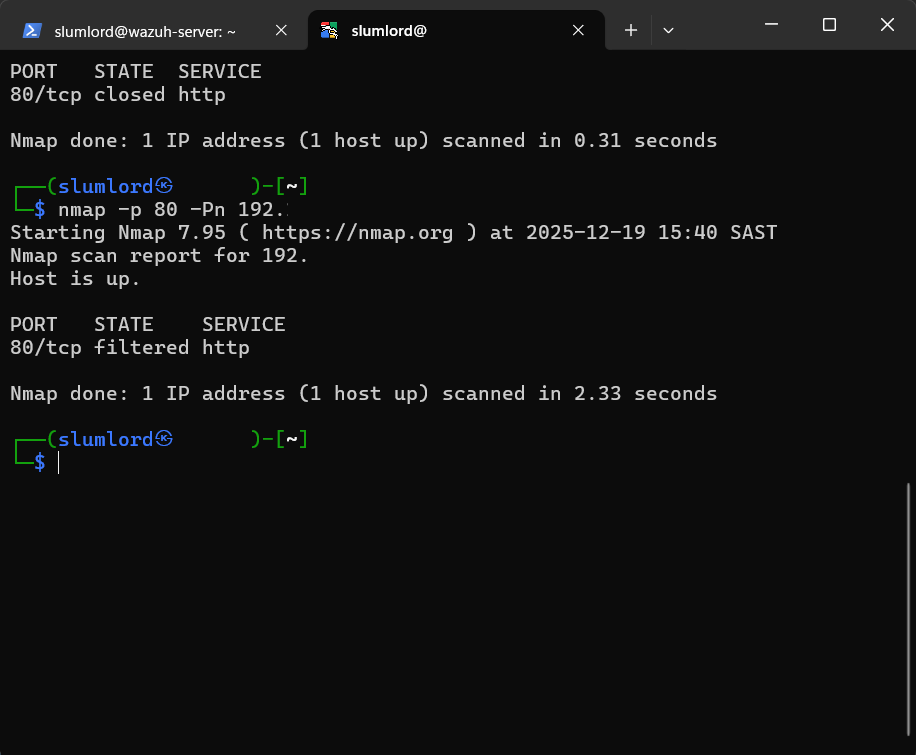
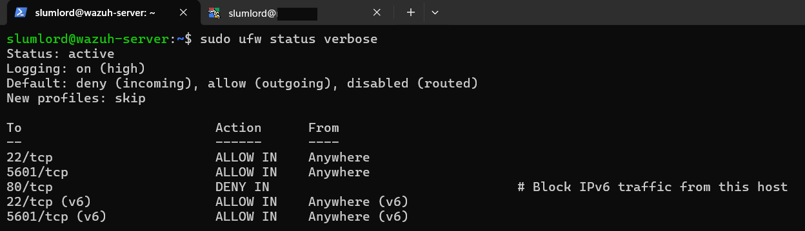
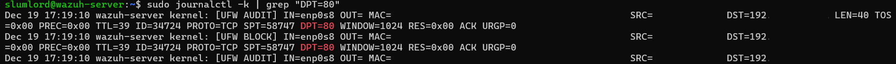

# Network-Based Attack Detection Using UFW

## 🎯 Objective

Simulating a network-based reconnaissance activity(port scan attack) and demonstrate how to detect it using ufw firewall logs on a Linux system. Learning how to launch the HTTP scan prob from Kali Linux(attacker) machine and detect these scan attempt on Victim machine using UFW.

## 🖥️ Requirements

**Systems:**  

- Attacker Machine: Kali Linux (or any Linux with nmap)
- Target Machine: Ubuntu Linux Server 

**Tools:**  

- nmap (on attacker machine)
- ufw or iptables (on target machine)

**Log Files:**

- /var/log/ufw.log on Ubuntu Server– Captures system and network-related messages

## 🧠 What is a Network Port Scan?

A port scan is a technique used by attackers to probe a system for open ports and active services. Tools like nmap are commonly used to map a system’s network surface. It is used identify:

- Open ports
- Running services
- Potential attack vector

Why It’s Dangerous

- Port scans are often a precursor to exploitation.
- They reveal exposed services (SSH, HTTP, FTP, or outdated web servers)
- Help attackers fingerprint operating systems and applications

What is Nmap?

Nmap (Network Mapper) is an open-source network discovery and scanning tool used for:

- Host discovery
- Service enumeration
- OS detection
- Vulnerability assessment
- Nmap Popular Scan Types

Common Nmap Scan Types

- SYN Scan (-sS): Fast and stealthy port scan.
- TCP Connect Scan (-sT): Full TCP connection, less stealthy.
- UDP Scan (-sU): Scans UDP ports for services.
- Ping Scan (-sn): Checks which hosts are up, no port scan.

🔐 What is UFW?

- UFW stands for Uncomplicated Firewall, a frontend for iptables.
- Simplifies firewall management for Linux users.
- Used to allow, deny, and manage traffic rules easily.
- Logs are stored in /var/log/ufw.log.
- Rule file /etc/ufw/before.rules
- To check ufw status (ufw status)
- To check the rule number (ufw status numbered)

## 🧾 UFW Rule Syntax

```bash
ufw allow <port>
ufw deny <port>
ufw allow ssh
ufw allow from <IP>
ufw allow from <IP> to any port <PORT>
ufw delete <RULE_NUMBER>
```

## **Step 1: Attack Simulation – Perform a Port Scan**

```bash
   nmap -p80 <TARGET-IP>
```

This sends TCP probes to the HTTP port to check whether it is open or filtered.

## **Step 2: Detection and Analysis – Analyze Syslog** 

1. Installing and enable UFW

```bash
sudo apt install ufw
sudo ufw enable
```

2. Enable detailed logging

```bash
sudo ufw logging on
sudo ufw logging high
```

This ensures dropped packets are logged with sufficient detail.

3. Create a Firewall rule to drop HTTP traffic from Attack machine

## **Step 3: Block HTTP Traffic from Attacker**

```bash
sudo ufw deny from <Attcker IP> to any port 80 proto tcp
```

3. Reload the firewall rules to take effect

```bash
   sudo ufw reload
```

## **Step 4: Detection – Analyze Firewall Logs**

4. Detect the HTTP Scanning traffic

```bash
   sudo tail -f /var/log/ufw.log | grep <Attcker IP>
```

Sample Log Indicators

- SRC=<Attacker IP> → Source of scan
- DPT=80 → Targeted port
- PROTO=TCP → Protocol used
- Timestamp → Attack timeline

These entries confirm active reconnaissance attempts being blocked and logged.

## 📸 Screenshots





## ⚠️ Important Lab Note (NAT vs Real IPs)

- If the attacker VM uses NAT networking, UFW logs may show the host IP instead of the attacker VM’s internal IP.
- To observe true attacker IP visibility, use:
- Host-Only Adapter
- Internal Network
- This mirrors real enterprise firewall behavior and improves detection realism.

## Conclusion:

This lab demonstrates:

1. ufw.log, combined with firewall logs, is powerful for detecting early-stage reconnaissance
2. Port scanning is often the first indicator of an attacker mapping your system
3. Detecting and blocking IPs performing scans is a crucial step in proactive defense
- Attacker IP
- Targeted service
- Timing and frequency
4. Blocking and logging malicious IPs is a core defensive control

