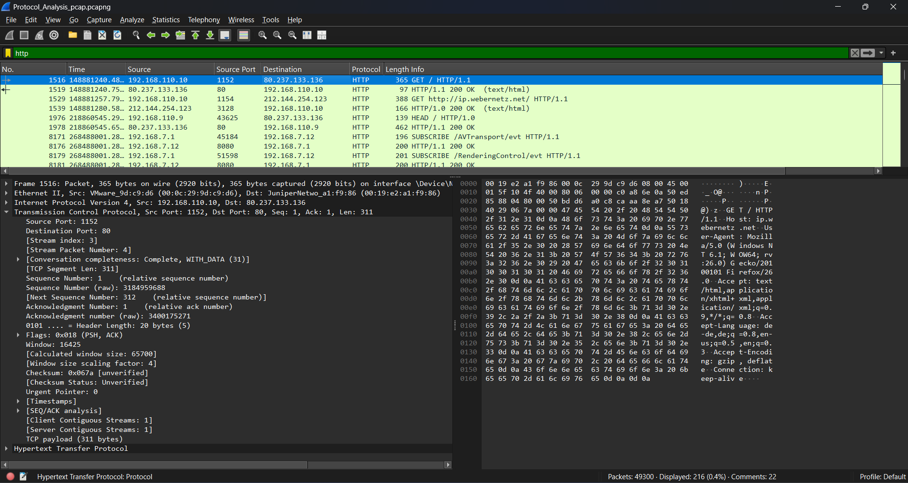

# Introduction to Wireshark – Packet Analysis for SOC Analysts

## 🎯 Objective

A lab to analyze HTTP (Hypertext Transfer Protocol) packets using Wireshark. Exploring HTTP request/response headers, understand how web communication works, and learn how to detect common HTTP-based attacks or data leaks.

## 🖥️ Requirements

**Systems:**  

- Operating System: Windows, Linux, or macOS
- Network Adapter: Required for packet capture  

**Tools:**  

- [Wireshark](https://www.wireshark.org/) (latest stable version)

## 📘 **HTTP Packet Structure and Fields**

HTTP is an **application-layer protocol** used for communication between clients (browsers) and web servers. It typically runs over TCP port **80**.

### **Key HTTP Fields:**

| Field Name         | Description                              |
|--------------------|------------------------------------------|
| **Request Method** | GET, POST, HEAD, etc.                    |
| **Host**           | The website being accessed               |
| **User-Agent**     | Information about the client/browser     |
| **URI**            | Resource path on the server              |
| **Status Code**    | Server's response status (e.g., 200 OK)  |
| **Content-Type**   | MIME type of the response (e.g., text/html) |
| **Cookie/Header**  | Session or tracking information          |

## 🔍 **Most Common HTTP Display Filters**

Use these filters in Wireshark’s **Display Filter** bar:

| Filter                    | Description                              |
|---------------------------|------------------------------------------|
| `http`                   | Show all HTTP traffic                    |
| `tcp.port == 80`         | HTTP traffic by default port             |
| `http.request.method == "GET"` | Show all GET requests             |
| `http.request.uri`       | View requested resources                 |
| `http.set_cookie`        | Show cookies in HTTP responses           |
| `ip.addr == 192.168.1.10`| HTTP traffic to/from specific host       |

## ✅ Conclusion

HTTP traffic is readable and easy to analyze in Wireshark.

1. Sensitive data exposure in URLs or headers
2. Malware beaconing to C2 servers
3. Suspicious file downloads or unauthorized access

## 📸 Screenshots
