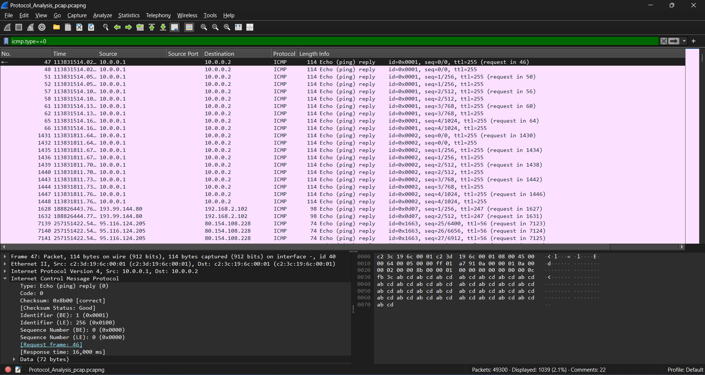

# Introduction to Wireshark – Packet Analysis for SOC Analysts

## 🎯 Objective

A lab to understand and analyze ICMP (Internet Control Message Protocol) packets using Wireshark. Learning to identify echo requests/replies, interpret ICMP packet fields, and apply relevant filters for investigation.

## 🖥️ Requirements

**Systems:**  

- Operating System: Windows, Linux, or macOS
- Network Adapter: Required for packet capture  

**Tools:**  

- [Wireshark](https://www.wireshark.org/) (latest stable version)

## 📘 **ICMP Packet Structure and Fields**

ICMP is oparates at the Layer 3 and is encapsulated within IP packets. It used for sending error messages and operational information. The most common ICMP messages include **Echo Request (Type 8)** and **Echo Reply (Type 0)**.

### **Key ICMP Fields:**

| Field Name       | Description                          |
|------------------|--------------------------------------|
| **Type**         | Defines the ICMP message type        |
| **Code**         | Provides further detail for the type |
| **Checksum**     | Error-checking for header            |
| **Identifier**   | Helps match requests and replies     |
| **Sequence No.** | Sequence of the request/reply        |
| **Data**         | Optional payload                     |

## 🔍 **Most Common ICMP Display Filters**

Use these filters in Wireshark’s **Display Filter** bar:

| Filter | Description |
|--------|-------------|
| `icmp` | Show all ICMP traffic |
| `icmp.type == 8` | Show Echo Requests (ping) |
| `icmp.type == 0` | Show Echo Replies |
| `icmp.type == 3` | Destination unreachable |
| `ip.addr == 192.168.1.10` | ICMP traffic from/to specific host |

## ✅ Conclusion

From a SOC analyst perspective, ICMP analysis is useful for detecting reconnaissance activity such as ping sweeps, network mapping, and host discovery attempts. Abnormal ICMP patterns may indicate early-stage attacker behavior or misconfigured network devices.

1. ICMP is a fundamental protocol for network troubleshooting.
2. Wireshark helps visualize ICMP packet flow and structure.
3. Understanding ICMP helps detect network scanning, ping sweeps, and unreachable hosts.

## 📸 Screenshots
