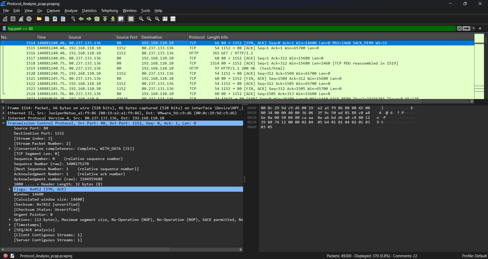

# Introduction to Wireshark – Packet Analysis for SOC Analysts

## 🎯 Objective

A lab to learn how to analyze TCP (Transmission Control Protocol) traffic using Wireshark. How TCP establishes connections, the 3-way handshake process, and how to interpret common TCP fields and flags.

## 🖥️ Requirements

**Systems:**  

- Operating System: Windows, Linux, or macOS
- Network Adapter: Required for packet capture  

**Tools:**  

- [Wireshark](https://www.wireshark.org/) (latest stable version)

## 📘 **TCP Packet Structure and Fields**

TCP is a **Layer 4 (Transport Layer)** protocol that ensures reliable, ordered, and error-checked delivery of data between applications.

### **Key TCP Fields:**

| Field Name         | Description                                  |
|--------------------|----------------------------------------------|
| **Source Port**     | Sender’s port number                         |
| **Destination Port**| Receiver’s port number                       |
| **Sequence Number** | Number of the first byte in the segment      |
| **Acknowledgment No** | Confirms received data                    |
| **Flags**           | Control bits (SYN, ACK, FIN, RST, PSH, URG) |
| **Window Size**     | Buffer size available                        |
| **Checksum**        | Error-checking field                         |

## 🔍 **Most Common TCP Display Filters**

Use these filters in Wireshark’s **Display Filter** bar:

| Filter                  | Description                              |
|--------------------------|------------------------------------------|
| `tcp`                   | Show all TCP packets                     |
| `tcp.flags.syn == 1 && tcp.flags.ack == 0`| Show SYN packets (start of connection)   |
| `tcp.flags.fin == 1`    | Show FIN packets (end of connection)     |
| `tcp.port == 80`        | Show TCP packets on port 80              |
| `ip.addr == 192.168.1.1`| TCP traffic to/from a specific host      |

## ✅ Conclusion

TCP ensures reliable and ordered data delivery through its 3-way handshake and flow control.

1. Connection state tracking
2. Troubleshooting dropped or reset connections
3. Detecting scanning and abnormal behavior (e.g., RST floods)

## 📸 Screenshots
