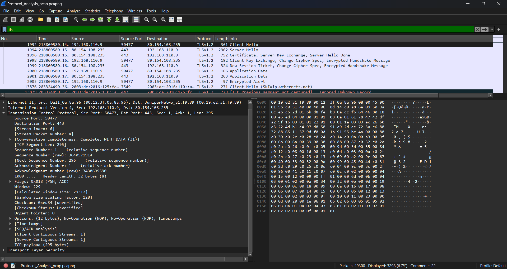

# Introduction to Wireshark – Packet Analysis for SOC Analysts

## 🎯 Objective

A lab is analyze TLS (Transport Layer Security) traffic using Wireshark. Exploring how TLS secures data over the network, understand handshake messages, and identify metadata like server names and certificate details.

## 🖥️ Requirements

**Systems:**  

- Operating System: Windows, Linux, or macOS
- Network Adapter: Required for packet capture  

**Tools:**  

- [Wireshark](https://www.wireshark.org/) (latest stable version)

## 📘 **TLS Packet Structure and Fields**

TLS is a **cryptographic protocol** that provides secure communication over the internet. It runs over **TCP**, commonly on port **443**, and is used in HTTPS, FTPS, SMTPS, etc.

### **Key TLS Handshake Messages:**

| Message Type          | Description                                      |
|------------------------|--------------------------------------------------|
| **Client Hello**       | Client initiates secure connection, offers cipher suites |
| **Server Hello**       | Server selects cipher and provides certificate  |
| **Certificate**        | Server provides digital certificate (X.509)     |
| **Key Exchange**       | Cryptographic parameters are exchanged to establish session keys |
| **Finished**           | Secure session begins                           |

## 🔍 **Most Common TLS Display Filters**

Use these filters in Wireshark’s **Display Filter** bar:

| Filter                        | Description                              |
|-------------------------------|------------------------------------------|
| `tls`                        | Show all TLS traffic                     |
| `tcp.port == 443`            | TLS over HTTPS                           |
| `tls.handshake.type == 1`    | Client Hello messages                    |
| `tls.handshake.type == 2`    | Server Hello messages                    |
| `tls.record.version == 0x0303`| TLS 1.2 traffic                         |
| `tls.record.version == 0x0304`| TLS 1.3 traffic                         |

## ✅ Conclusion

TLS secures communication using encryption, making traffic unreadable without keys.
Wireshark cannot decrypt TLS traffic by default but can still reveal important metadata

1. Server name (SNI)
2. Certificate chain
3. TLS versions and cipher suites

## 📸 Screenshots
